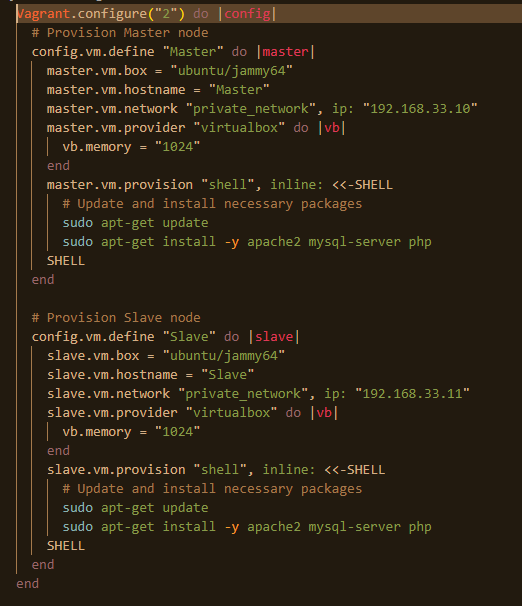
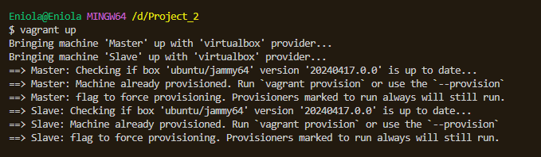
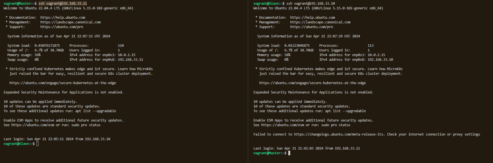
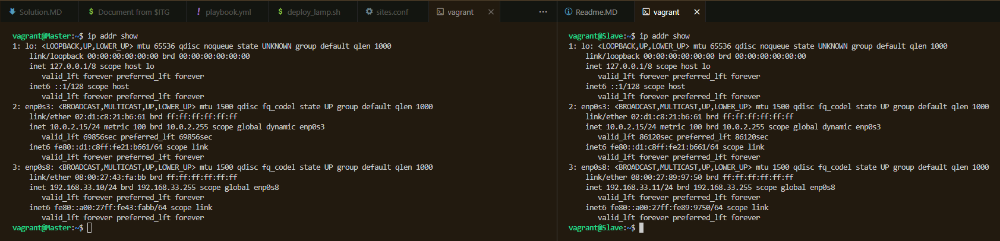
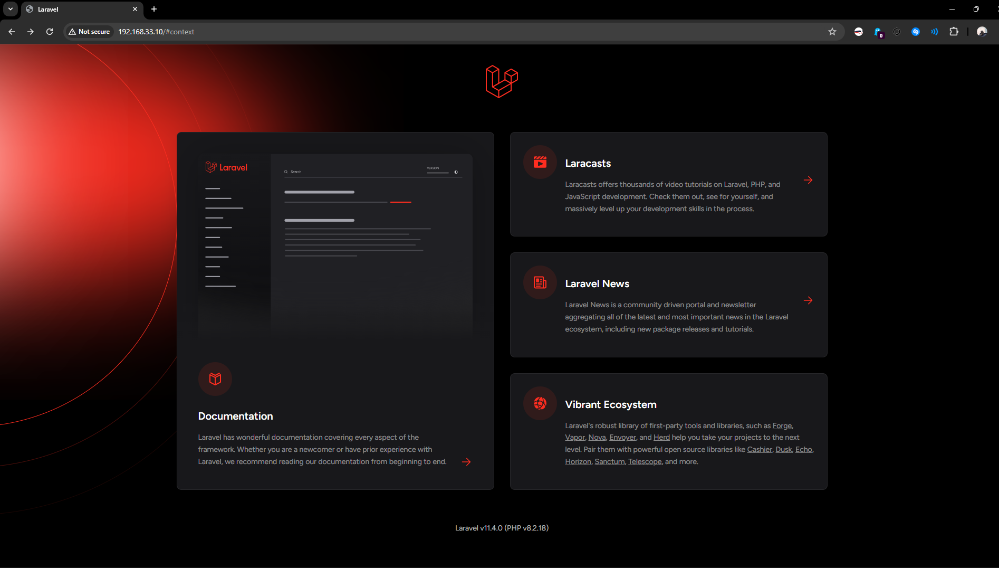
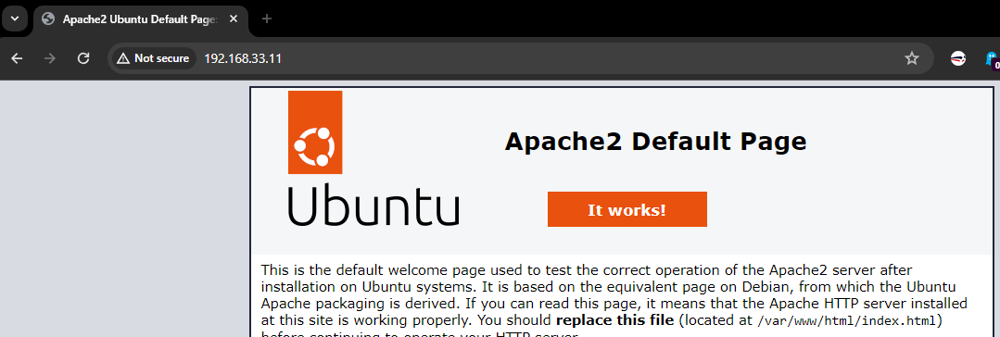
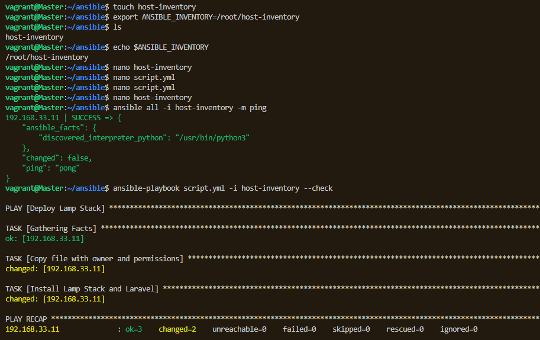
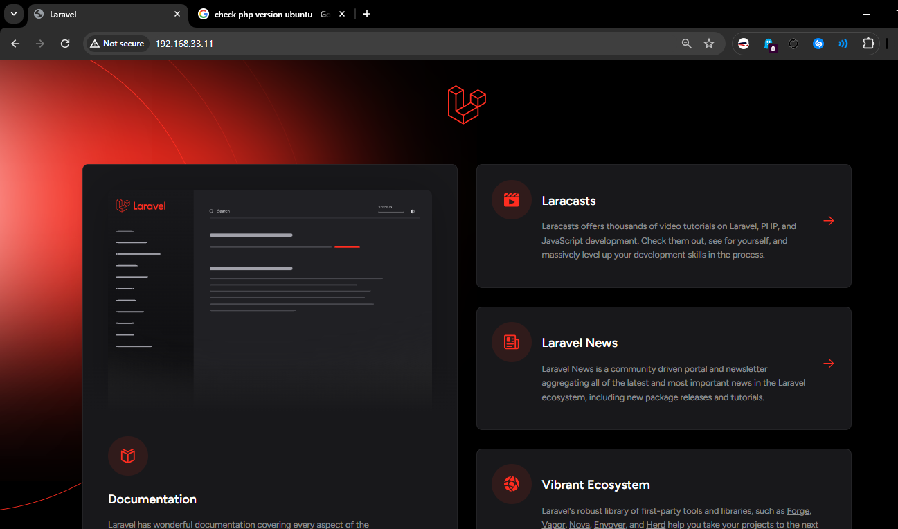
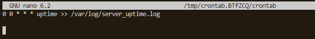
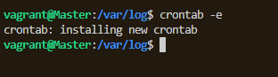

###  Vagrantfile Configuration to install two Ubuntu-based servers named “Master” and “Slave” using Vagrant.  

### Bringing up Master and Slave servers  

### Master and Slave machines running on Oracle VM  

### SSH into Master and Slave servers  

### Create a bash script to automate the deployment of a LAMP (Linux, Apache, MySQL, PHP) stack.  
##### touch deploy_lamp.sh 
##### nano deploy_lamp.sh 
##### chmod u+x deploy_lamp.sh
##### ./deploy_lamp.sh

### IP addresses of both Servers  

### Laravel on Master Server   

### Slave IP address before running Ansible playbook 

### Ansible playbook to deploy Lamp and Laravel on Slave Server 

### 'Verify that the PHP application is accessible through the VM’s IP address (take screenshot of this as evidence)'  

### 'Create a cron job to check the server’s uptime every 12 am'  

